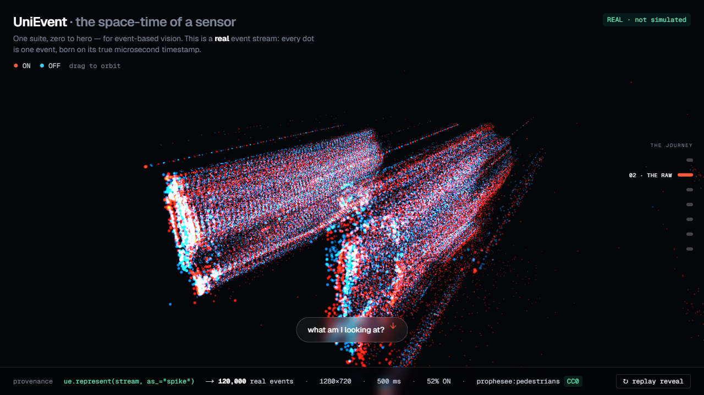
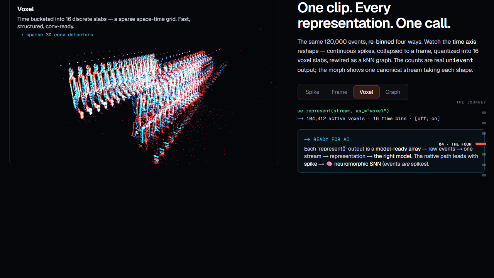
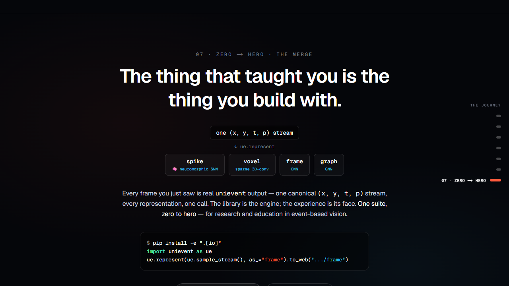

<div align="center">

# UniEvent

### One suite. Zero to hero — for event-based (neuromorphic) vision.

<a href="https://uni-event-yazan-inquire.vercel.app"></a>

**Any event-camera recording → one canonical `(x, y, t, p)` stream → spike · voxel · frame · graph, from a single call.**

```python
import unievent as ue
ue.represent(stream, as_="frame")     # spike · voxel · frame · graph — one call, any stream
```

### [**▶ Open the live experience →**](https://uni-event-yazan-inquire.vercel.app)

<sub> Built with **Claude** (Opus 4.8) · 🟠 **Anthropic Build Day** · San Francisco · 13 Jun 2026 · @Shack15</sub>

</div>

---

> **Why this exists.** Event cameras are the most exciting sensor in computer vision — microsecond latency, HDR, sparse, power-sipping — and the hardest to *get into*: no on-ramp where a newcomer sees what an event stream *is*, feels why the representation matters, and walks out building with a real tool. **UniEvent is that on-ramp** — research-and-education infrastructure: one problem → one solution, taught from first principles, open-source for the field.
>
> Built by **Yazan** ([@INQUIRELAB](https://github.com/INQUIRELAB)) — PhD researcher and educator in neuromorphic, event-based vision. *(An Event-Vision-to-AI textbook is on the way from our INQUIRE.ai team.)*

## Two legs, one suite

| | | |
|---|---|---|
| **UniEvent** — the library, the **engine** | Canonical `(x,y,t,p)` → every representation, one import, fully typed, integrity-checked. |
| **The Labs** — the experience, the **face** | A Next.js + R3F + GSAP journey that teaches from first principles — and renders **real UniEvent output**. Zero backend on stage. |

**The merge:** the thing that *teaches* you is the thing you *build* with. Every visual on the site is a real `unievent.web.export()` bundle from a real CC0 recording — with provenance behind each frame.

## The journey — zero to hero

`01 The Eye` (why event cameras) → `02 The Raw` (the space-time cloud) → `03 The Reveal` (accumulate → two people) → `04 The Four` (one stream, four representations) → `05 The Old Way` (the tangle vs the one import) → `06 The Read` (Claude reads the sensor) → `07 Zero → Hero`.

<div align="center"></div>

> The same events, re-binned four ways — each a real `ue.represent(stream, as_=…)` call, each labelled with the AI model it feeds (**spike → 🧠 neuromorphic SNN**, frame → CNN, voxel → sparse 3D-conv, graph → GNN). Raw events → one stream → representation → the right model.

## From a tangle of formats to one import

The event-camera world has no standard. Do it yourself and you write — per dataset — a decoder, a parser, a builder for *every* representation, and a visualizer for *every* one.

| The usual way | UniEvent |
|---|---|
| A decoder per vendor format (`.raw` · `.aedat` · `.dat` · HDF5) | **one import** — `import unievent as ue` |
| A hand-written builder + visualizer for **each** representation | **`ue.represent(stream, as_=…)`** → all four, seeded + tested |
| Per-dataset glue, repeated for every new dataset | **model-ready arrays** + web bundles, in one call |

> **Scope (claim = deliver).** The canonical `(x, y, t, p)` model + `represent()` work on **any** event stream you can load into those arrays. UniEvent ships a **Prophesee `.raw` decoder** + a uniform adapter pattern (adding a dataset is a small, consistent addition) — it does *not* decode every vendor format out of the box; the point is it doesn't need to.

## How it scores

- **Impact** — the field's most exciting sensor has its steepest on-ramp; UniEvent is the missing unified bridge from raw events to AI-ready representations, on real CC0 data, end to end — by an educator in the field.
- **Demo** — a live, deployed [zero-to-hero experience](https://uni-event-yazan-inquire.vercel.app): performed cloud → legible event frame → four representations → Claude reading the sensor.
- **Opus 4.8 creative use** — (1) an in-Labs tutor that *perceives a sensor modality it cannot natively see*, grounded in real computed stats (never vibes) + a live, capped "ask about this clip"; (2) a **test-gated adapter generator** (`python scripts/adapter_demo.py`): paste a new format → Opus writes a conforming adapter → the conformance gate flashes green → all four builders run. Real, self-verifying engineering.
- **Orchestration** — the autonomy story below + a machine-checkable rubric (`make grade` **8/8**).

<details>
<summary><b>How this was built</b> — the autonomy story (sourced from <code>git log</code>)</summary>

Briefed once with a vision + a **machine-checkable rubric**, then told to go — Claude (Opus 4.8) ran the build itself. By the git log, the initial build was **9 commits, `14:36`→`16:34`** (`git log --reverse`): it designed the library, decoded the CC0 recording, baked real bundles **through** the library, ported a reference's *logic while fixing its bugs* (unseeded RNG → seeded, `argmax` time-collapse → full structure, silent skips → fail-loud), and **screenshotted its own WebGL with Playwright** — catching and fixing its own bugs (a 145× point-size blowout; an un-legible hero window) — all while keeping `make grade` green. It survived a **mid-session socket drop** and continued on a one-line "continue"; the only human inputs were answers to its **own clarifying questions** + a single "looks right." A second focused brief drove the finishing pass — same loop: **brief → autonomous → verify.** The proof is the commit history itself (`git log`).
</details>

## The library

```python
import unievent as ue

stream = ue.sample_stream()             # real raw t,x,y,p (CC0 Prophesee clip) — or your own (x,y,t,p)
ue.represent(stream, as_="spike")       # SNN-ready raw spikes — the hero
ue.represent(stream, as_="voxel")       # sparse (t_bin,y,x) grid + [off,on] feats
ue.represent(stream, as_="frame")       # signed accumulation image (H,W)
ue.represent(stream, as_="graph")       # kNN graph in normalized (x,y,t)

ue.represent(stream, as_="frame").to_web("labs/public/data/frame")   # bake a static web bundle
```

### Integrity rule (identical in `SPEC.md`, `rubric.md`, here)

> `spike` requires a raw `EventStream`. `represent(EventSample, as_="spike")` **RAISES** — you cannot fabricate real per-event spikes from an aggregate. Events ARE spikes; once aggregated they are gone.

A tested contract (`tests/test_integrity.py`). Real failures crash loudly. Every visual traces to a real `source` with a `simulated` flag — the hero is `simulated: 0`, CC0.

<div align="center"></div>

## Install

```bash
pip install "git+https://github.com/INQUIRELAB/UNI_EVENT.git"            # core (numpy + scipy)
pip install "unievent[io] @ git+https://github.com/INQUIRELAB/UNI_EVENT.git"   # + the Prophesee .raw decoder
```

Lean by design: the base install is just `numpy` + `scipy`, so you can run `represent()` on your own `(t,x,y,p)` arrays immediately. The `.raw` decoder (`[io]`), Opus adapter-gen (`[ai]`), and DL deps (`[datasets]`) are opt-in.

## Reproduce (`make grade`)

`done` is machine-verifiable. [`rubric.md`](rubric.md) is real commands with real exit codes; `make grade` prints a scorecard (currently **8/8**): install · `pytest` · four builders match SPEC · the spike-integrity raise · bundles schema-conformant · the live URL responds · clean-clone reproduce · the built-today fence.

## Layout

```
unievent/             core (x,y,t,p) model · represent() · web.export · io · cli · MODEL_HINT
labs/                 Next.js + R3F + GSAP — renders real UniEvent output (+ app/api/ask → Opus 4.8)
scripts/              make_bundles · clip_stats · adapter_demo (Opus) · grade.sh · reproduce.sh
rubric.md · WEB_BUNDLE_SCHEMA.md · SPEC.md
```

<div align="center">
<sub>MIT-licensed library · CC0 hero data · open-source for the field · built in one day, commit by commit.</sub>
</div>
